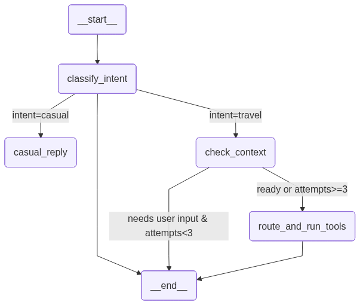

# Smart Travel Planner — Production AI Agent System

A full-stack AI agent that plans entire trips from natural-language chat: destination
research (RAG), live weather/flights/currency, ML-powered travel-style prediction —
all synthesized into a coherent, streamed plan with optional email delivery.

**Stack:** FastAPI · LangGraph · LangChain · Azure OpenAI · PostgreSQL + pgvector ·
SQLAlchemy 2.x async · React + Vite · Docker · HashiCorp Vault · Resend

---

## Quick Start

```bash
git clone <repo-url> && cd project

# 1. Configure environment
cp .env.example .env   # fill in AZURE_OPENAI_KEY, etc.

# 2. Start all services (Postgres, Vault, pgAdmin, backend, frontend)
docker compose up --build -d

# 3. Run database migrations
cd backend && uv run alembic upgrade head

# 4. Ingest destination documents into pgvector
curl -X POST http://localhost:8000/rag/ingest

# 5. Verify
curl http://localhost:8000/health        # API + ML + LLM status
curl http://localhost:8000/rag/query -H "Content-Type: application/json" \
  -d '{"query":"budget-friendly beach in Asia"}'

# 6. Open the app
open http://localhost:5173
```

**Local development (without Docker):**
```bash
cd backend
uv run uvicorn main:app --reload   # API on :8000

cd frontend
npm install && npm run dev          # UI on :5173
```

---

## Architecture



The agent flow passes through four LangGraph nodes, routing conditionally based on intent
and context completeness:

| Node | Model | Purpose |
|------|-------|---------|
| `classify_intent` | Cheap | Determine if the query is casual chitchat or a real travel request |
| `casual_reply` | Cheap | Handle greetings, fictional destinations (Mars → Iceland), thanks |
| `check_context` | Cheap + Embedder | Detect destination via RAG, extract origin country, determine what's missing |
| `route_and_run_tools` | Cheap + 5 Tools | Select and execute the appropriate tools in parallel |
| `synthesize` | **Strong** | Combine all tool outputs into a coherent, personalized travel plan (streamed token-by-token via SSE) |

**System layers:**

```
Browser (React/Vite) ──SSE──► FastAPI ──► LangGraph Agent
                                              │
                              ┌───────────────┼───────────────┐
                              ▼               ▼               ▼
                        PostgreSQL       Azure OpenAI     External APIs
                        + pgvector       (2 LLMs +       (wttr.in,
                        (HNSW idx)        embedder)       frankfurter,
                                                          DuckDuckGo)
                                              │
                          HashiCorp Vault      │        Resend
                          (secrets)            │        (email)
                                              ▼
                                         LangSmith
                                         (tracing)
```

---

## Requirements Coverage

All 9 mandatory requirements from `INSTRUCTIONS.md` are implemented:

| # | Requirement | Key Implementation |
|---|-------------|-------------------|
| 1 | **ML Tool Integration** | RandomForest loaded via `joblib` at lifespan (`main.py:47`), exposed via `Depends(get_model)`, async-wrapper in `services/ml_inference.py`, wired as LangGraph tool |
| 2 | **RAG Tool** | Full pipeline: load → chunk → embed → insert → retrieve. pgvector cosine similarity, HNSW index, 500-char chunks, 50-char overlap, k=3 for agent, score threshold 0.6 |
| 3 | **Agent With 3+ Tools** | LangGraph StateGraph with 4 nodes, **5 tools** (rag, ml, weather, flights, fx), Pydantic validation on every tool input, explicit tool allowlist |
| 4 | **Two Models, One Agent** | Cheap (gpt-4o-mini) for mechanical tasks, Strong (Kimi-K2.6-1) for synthesis only. Token usage tracked per step → persisted in `agent_runs` |
| 5 | **Persistence** | SQLAlchemy 2.x async, 5 ORM models, 3 Alembic migrations. `AgentRun` + `ToolLog` rows written on every query |
| 6 | **Auth** | bcrypt password hashing, JWT (HS256, 60-min expiry). `get_current_user` dependency scopes all data to authenticated user |
| 7 | **React Frontend** | Chat UI with SSE streaming, tool log panel, signup/login, auth guard. 7 SSE event types handled |
| 8 | **Webhook Delivery** | Resend email delivery triggered via `ask_email` SSE event. Background task — failure never blocks user response |
| 9 | **Docker** | Single `docker compose up` — 5 services (db, vault, pgadmin, backend, frontend), named Postgres volume, healthchecks |

---

## Technology Choices & Rationale

### Why FastAPI + Lifespan + `Depends()`?

All singletons (ML model, LLM clients, DB engine) are created **once** during
`lifespan` startup and stored on `app.state`. They are injected into routes via
`Depends()` — never global variables. This makes every dependency:

- **Testable** — `app.dependency_overrides[dep] = lambda: mock` replaces any
  dependency without touching production code
- **Type-safe** — route signatures declare exactly what they need
- **Lazy-failure** — if the ML model fails to load at startup, the error is
  stored and surfaced only when the `/ml/predict` endpoint is actually called

### Why Two Models?

| | Cheap (gpt-4o-mini) | Strong (Kimi-K2.6-1) |
|---|---|---|
| **Cost** | ~$0.15/M input tokens | Higher, justified by output quality |
| **Used for** | Intent classification, context checking, tool routing, casual replies | Final plan synthesis (the user-facing answer) |
| **Why** | These are mechanical tasks — extract structured JSON, no creativity needed | Synthesis requires comparing conflicting tool outputs, weighing tradeoffs, generating readable prose |

The cheap model handles ~75% of all LLM calls. Only the final answer uses the
expensive model.

### Why LangGraph (not raw LangChain)?

LangGraph's `StateGraph` gives us explicit control over the agent's decision flow:

- **Conditional edges** route based on state (`intent`, `needs_user_input`,
  `clarification_attempts`), not just LLM output
- **Parallel tool execution** via `asyncio.gather` — all 5 tools run concurrently,
  not sequentially
- **State persistence** — the `AgentState` TypedDict carries ~20 fields between
  nodes (origin, destination, tool results, tokens, etc.)
- **Observability** — every node transition is traced via LangSmith

### Why pgvector + HNSW?

| Decision | Rationale |
|----------|-----------|
| **Same DB for data + vectors** | No separate vector database to manage. One connection string. One backup. |
| **HNSW index** | Best for small-to-medium datasets (<1M vectors). Faster than IVFFlat at comparable recall. |
| **Cosine distance** | Matches the embedding model's training objective. Converted to similarity: `1 - (a <=> b)`. |
| **1536-dim (not 768)** | text-embedding-3-small's native dimensionality. Better retrieval quality. Worth the extra storage. |
| **Score threshold 0.6** | Filtered after retrieval — prevents low-confidence noise from reaching the synthesis prompt. |

### Why Free External APIs?

| Service | Tool | Why not a paid API? |
|---------|------|---------------------|
| wttr.in | Weather | No key, no signup, supports lat/long, backed by Open-Meteo |
| frankfurter.app | FX rates | ECB data (official), no key, via-EUR fallback for unsupported pairs |
| DuckDuckGo | Flights | Returns real snippets from Skyscanner/Kayak — current prices without scraping |

All three have retry + exponential backoff (1s, 2s, 4s) and TTL caching.

### Why `ChatOpenAI` (v1 API) instead of `AzureChatOpenAI`?

Azure's v1 API endpoints accept standard OpenAI-compatible requests. Using
`ChatOpenAI(base_url=..., api_key=...)` avoids the `api_version` and
`azure_deployment` parameters that `AzureChatOpenAI` requires. Same functionality,
simpler config, documented as the recommended approach by LangChain.

---

## API Reference

| Method | Endpoint | Auth | Description |
|--------|----------|:----:|-------------|
| `GET` | `/health` | — | Composite: API + ML model + LLM status |
| `GET` | `/health/db` | — | PostgreSQL connectivity |
| `GET` | `/health/llm` | — | Azure OpenAI reachability (TTL-cached 60s) |
| `POST` | `/auth/signup` | — | Register + get JWT |
| `POST` | `/auth/login` | — | Authenticate + get JWT |
| `GET` | `/user/me` | JWT | Current user profile |
| `GET` | `/user/stats` | JWT | Usage statistics |
| `POST` | `/agent/chat` | JWT | Chat with agent (**SSE stream**) |
| `GET` | `/agent/history` | JWT | Past agent runs |
| `POST` | `/agent/send-email` | JWT | Email travel plan |
| `POST` | `/ml/predict` | — | ML travel-style prediction |
| `POST` | `/rag/ingest` | — | Ingest documents into vector store |
| `POST` | `/rag/query` | — | Cosine similarity search |

### SSE Events (from `/agent/chat`)

| Event | Payload | When |
|-------|---------|------|
| `thinking` | `{"message": "..."}` | Agent starts processing |
| `tool_start` | `{"tool": "weather_fetcher", "input": {...}}` | Tool begins execution |
| `tool_result` | `{"tool": "...", "output": "...", "latency_ms": 120}` | Tool completes |
| `needs_input` | `{"question": "Where are you traveling from?"}` | Agent needs clarification |
| `token` | `{"text": "## Your"}` | Synthesis streaming token |
| `final` | `{"response": "...", "tool_logs": [...], "prompt_tokens": N, "completion_tokens": N}` | Response complete |
| `ask_email` | `{"question": "Would you like me to send...", "plan": "...", "destination": "..."}` | Email delivery prompt |

---

## RAG Pipeline

**Ingestion** (manual, `POST /rag/ingest`):

```
19 JSON files → RecursiveCharacterTextSplitter (500 char, 50 overlap)
              → Azure OpenAI text-embedding-3-small (1536-dim, batch=16)
              → INSERT INTO documents (full wipe-and-replace)
```

**Retrieval** (per query):

```
User query → embed (same model) → cosine similarity via pgvector <=> operator
           → top-k=3 → filter score ≥ 0.6 → prompt assembly → strong LLM synthesis
```

| Parameter | Value | Justification |
|-----------|-------|---------------|
| Chunk size | 500 | Each destination doc is ~300–400 chars — nearly 1:1 document-to-chunk, preserving semantic integrity |
| Chunk overlap | 50 | Continuity for rare large docs; minimal since splitting is uncommon |
| Default k | 5 | ~25% of corpus — enough coverage without noise |
| Agent k | 3 | Tighter prompt context inside the agent |
| Score threshold | 0.6 | Enforced in executor (`agent/graph.py:459`), not just the prompt — drift-proof |
| Embed batch size | 16 | Conservative — stays within Azure OpenAI TPM/RPM limits |

---

## Agent Design

### Tool Allowlist & Hallucination Guard

Only 5 registered tool names can execute (`tools/__init__.py`):

```
rag_retriever  ·  ml_predictor  ·  weather_fetcher  ·  flight_searcher  ·  fx_checker
```

Any tool name from the LLM not in `ALLOWED_TOOLS` is rejected **before execution**
with a `[REJECTED]` marker. The error is returned to the LLM (never raised), so
the agent can recover.

### Clarification Loop Guard

If the user fails to provide an origin country after 3 attempts, the agent proceeds
with planning anyway (`agent/graph.py:602`). This prevents infinite clarification loops
on ambiguous or stubborn inputs.

### Conflict Resolution in Synthesis

The strong LLM is instructed to **compare and resolve** conflicting tool outputs:

- If RAG says "budget-friendly" but weather shows peak-season prices, the synthesis
  explains the tension
- If a tool returns an error, the gap is acknowledged rather than silently skipped
- Actual numbers (temperatures, exchange rates, prices) are surfaced verbatim

### Per-Query Cost

| Scenario | Cheap Calls | Strong Calls | Tools |
|----------|:-----------:|:------------:|-------|
| "hi" / "thanks" | 2 | 0 | 0 |
| "plan Bali from Cairo" (origin known) | 3 | 1 (stream) | ≤5 |
| "plan Maldives" → "Lebanon" (2-turn) | 5 | 1 (stream) | ≤5 |

All 5 tools run in **parallel** via `asyncio.gather` — no sequential bottleneck.
External API calls (wttr.in, frankfurter, DuckDuckGo) are free.

---

## Testing

```bash
cd backend && uv run pytest -v
```

**101 tests across 8 files, zero external dependencies** — everything is mocked:

| Suite | Tests | What It Covers |
|-------|:-----:|----------------|
| `test_schemas.py` | 23 | Pydantic valid/invalid/boundary validation for all request/response schemas |
| `test_auth.py` | 9 | bcrypt hash round-trip, JWT create/decode/expire/tamper |
| `test_services/test_weather.py` | 6 | httpx mocking, 3-retry backoff, TTL cache |
| `test_services/test_flights.py` | 6 | DDGS mocking, per-route cache, retries |
| `test_services/test_fx.py` | 8 | Via-EUR fallback, same-currency, caching |
| `test_services/test_send_plan.py` | 9 | Markdown→HTML conversion, Resend success/failure |
| `test_tools/` | 12 | ML invalid input (list vs dict), RAG score threshold, k capping, allowlist |
| `test_graph_nodes.py` | 22 | Individual node behavior: classify (bypass, timeout), check_context (3-tier destination, loop guard), route (parallel exec, hallucination rejection) |
| `test_agent_e2e.py` | 4 | Full pipeline: travel plan, casual bypass, needs-input flow, tool-failure degradation |

All LLM, database, and external API calls are mocked. No Postgres or Azure keys needed.

---

## Engineering Standards

Every line of this codebase follows the non-negotiable standards from `INSTRUCTIONS.md`:

- **Async All The Way** — `async def` throughout. Zero `time.sleep`, zero `requests`. `httpx.AsyncClient`, async SQLAlchemy, async LLM SDKs.
- **Dependency Injection** — every singleton via `Depends()`. Overridable in tests. Zero module-level globals.
- **Singletons via Lifespan** — init once, expose via `Depends()`. DB engine, ML model, LLM clients, embedder.
- **Caching** — `@lru_cache` for config/model paths. TTL cache for volatile tool responses (weather 10min, flights 30min, FX 60min).
- **Single Config Class** — `pydantic-settings` in `config.py`. Typed, validated at startup. Reads from OS env → Vault → `.env` → defaults.
- **Type Hints & Pydantic Boundaries** — 100% typed. Validation at HTTP bodies, tool inputs, LLM outputs.
- **Errors & Retries** — Timeouts + exponential backoff on all external calls. Exhausted retries → structured log + graceful fallback. Tool errors returned to LLM, never raised.
- **Code Hygiene** — Modular layout (routers/services/models/tools/rag/agent). JSON logging. No `print()`. `.env.example` present.
- **Secrets in Vault** — JWT secret and Azure key fetched from HashiCorp Vault at startup. `.env` is a fallback only.

---

## Project Structure

```
project/
├── agent_graph.png              # Agent workflow visualization
├── docker-compose.yml           # 5 services (db, vault, pgadmin, backend, frontend)
├── .env / .env.example          # Runtime configuration
├── db-schema.sql                # Full DDL with vector(1536), HNSW + GIN indexes
├── vault-init.sh                # Seeds secrets into Vault on boot
├── documents/                   # 19 destination JSON files (6 travel styles)
├── backend/
│   ├── main.py                  # FastAPI app + lifespan + CORS + composite /health
│   ├── config.py                # Single pydantic-settings class + HashiCorpVaultSource
│   ├── dependencies.py          # Depends() providers: model, LLMs, embedder, current_user
│   ├── agent/                   # LangGraph orchestration
│   │   ├── graph.py             # 4-node StateGraph + 5 tool executors
│   │   ├── state.py             # AgentState TypedDict (~20 fields)
│   │   └── prompts.py           # 5 prompt templates (classify, casual, check, route, synthesis)
│   ├── tools/                   # 5 agent tools with Pydantic input validation + allowlist
│   ├── services/                # Business logic: weather, flights, FX, ML inference, auth, email
│   ├── rag/                     # RAG pipeline: loader, chunker, embedder, ingestion, retriever
│   ├── routers/                 # FastAPI route handlers (health, auth, user, agent, ml, rag)
│   ├── models/                  # SQLAlchemy ORM (5 tables) + Pydantic schemas
│   ├── llm/                     # Azure OpenAI client factories + health check
│   ├── db/                      # Async session factory (asyncpg)
│   ├── alembic/                 # DB migrations (3 versions, pgvector-aware env.py)
│   ├── scripts/                 # Utilities (visualize_graph.py, probe_prompts.py)
│   ├── tests/                   # 101 tests across 8 suites (see Testing section)
│   └── artifacts/               # ML model (random_forest_travel_model.pkl)
└── frontend/
    ├── src/
    │   ├── api.js               # SSE streaming client + JWT management
    │   └── components/          # ChatPanel, ToolLogPanel, AuthGuard, Login, Signup, etc.
    └── Dockerfile               # Node 22 alpine, Vite dev server
```

---

## Configuration Reference

| Variable | Purpose | Source |
|----------|---------|--------|
| `DATABASE_URL` | PostgreSQL connection string | `.env` / compose |
| `JWT_SECRET_KEY` | HS256 signing key | **Vault** (`.env` fallback) |
| `AZURE_OPENAI_KEY` | Azure API authentication | **Vault** (`.env` fallback) |
| `AZURE_OPENAI_ENDPOINT` | Azure OpenAI resource URL | `.env` / compose |
| `AZURE_STRONG_MODEL` | Synthesis model (Kimi-K2.6-1) | `.env` / compose |
| `AZURE_CHEAP_MODEL` | Mechanical tasks (gpt-4o-mini) | `.env` / compose |
| `AZURE_EMBEDDING_MODEL` | text-embedding-3-small-1 | `.env` / compose |
| `LANGSMITH_*` | Tracing configuration | `.env` / compose |
| `VAULT_ADDR` / `VAULT_TOKEN` | HashiCorp Vault connection | `.env` / compose |
| `RESEND_API_KEY` | Email delivery | `.env` |
| `ALLOWED_ORIGINS` | CORS origin(s) | `.env` |

---

## Deliverables

- [x] GitHub repo with full codebase
- [x] README with architecture diagram, chunking rationale, cost breakdown
- [x] LangSmith tracing configured
- [x] 101 automated tests (tool isolation, Pydantic, E2E)
- [ ] LangSmith multi-tool trace screenshot
- [ ] 3-minute demo video (React UI → tool execution → email delivery)

---

*Built for Week 4 AI Engineering Bootcamp — May 2026*
